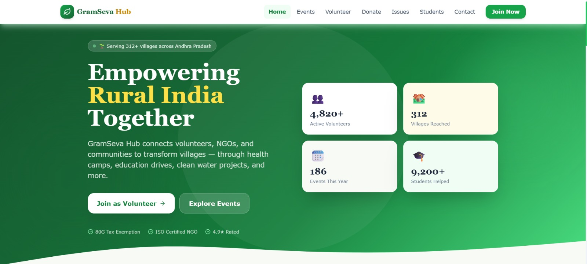
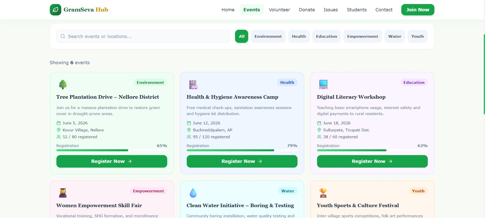
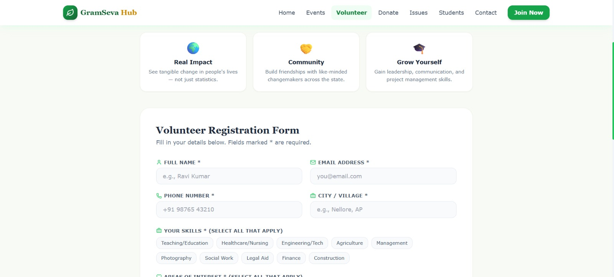
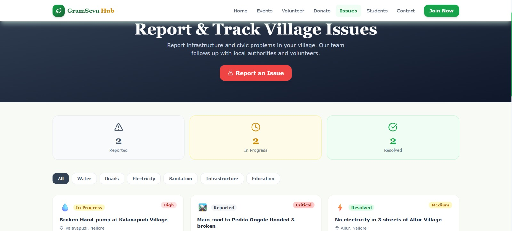
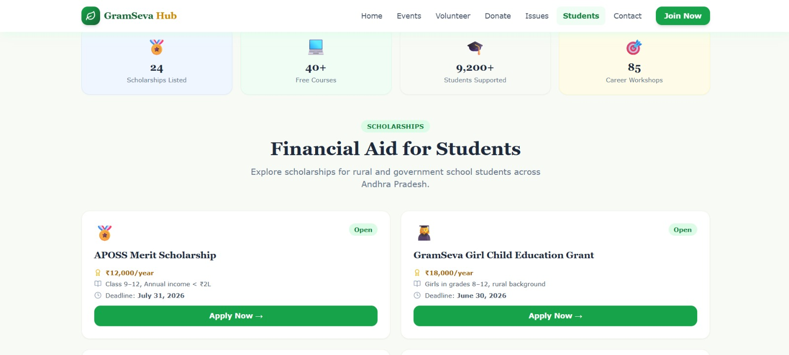

# 🌿 GramSeva Hub

**Empowering rural communities in Andhra Pradesh with a modern volunteer and support platform.**

## 🔗 Live Demo

https://gramseva-hub.netlify.app

## 📌 Project Description

GramSeva Hub is a responsive React web application designed for rural community support, volunteer coordination, donation campaigns, event management, issue reporting, and student empowerment across villages in Andhra Pradesh. The platform showcases a polished NGO-style dashboard interface with static data to demonstrate a complete digital experience for community outreach.

## 🎯 Project Purpose

This project was developed as a *CSP (Community Service Project)* after
completing my 2nd year B.Tech ECE at Narayana Engineering College, Nellore.
It aims to present a professional front-end solution for rural social impact
programs, with emphasis on accessibility, usability, responsive design, and
modern UI best practices

## ✨ Features

- ✅ Modern responsive React + Vite application
- ✅ Tailwind CSS-powered UI with soft green palette and rounded layouts
- ✅ Dynamic event cards and volunteer registration workflow
- ✅ Donation campaigns with progress tracking and resource needs
- ✅ Community issue reporting dashboard with category filters
- ✅ Student support section with scholarships, courses, and career guidance
- ✅ Fully responsive navigation, hover effects, and modal interactions
- ✅ Static dummy data for a complete portfolio-ready demo

## 📸 Screenshots

### 🏠 Home Page


### 📅 Events Page


### 🙋 Volunteer Registration


### 🚨 Community Issues


### 🎓 Student Support


## 📄 Pages

| Page | Route | Description |
| --- | --- | --- |
| Home | `/` | Launch page with hero, mission, stats, featured events, donation highlights, and testimonials |
| Events | `/events` | Searchable event catalogue with category filters and registration actions |
| Volunteer Registration | `/volunteer` | Volunteer signup form with skill selection, interests, availability, and validation |
| Donation & Support | `/donate` | Donation campaign cards, resource needs, transparency section, and impact overview |
| Community Issues | `/issues` | Village issue tracking, reporting form, issue categories, and status summaries |
| Student Support | `/students` | Scholarship listings, free course resources, and career guidance content |
| Contact | `/contact` | Contact form, organization details, social links, and map placeholder |

## 🛠️ Tech Stack

- React 18
- Vite
- Tailwind CSS v3
- React Router DOM
- Lucide React

## 🚀 Run Locally

```bash
# Clone repository
git clone https://github.com/shaikrafiyakousar/gramseva-hub.git
cd gramseva-hub

# Install dependencies
npm install

# Run development server
npm run dev
```

## 🗂️ Project Folder Structure

```text
gramseva-hub/
├─ public/
├─ src/
│  ├─ assets/
│  ├─ components/
│  │  ├─ Cards.jsx
│  │  ├─ Footer.jsx
│  │  └─ Navbar.jsx
│  ├─ data/
│  │  └─ index.js
│  ├─ pages/
│  │  ├─ Contact.jsx
│  │  ├─ Donate.jsx
│  │  ├─ Events.jsx
│  │  ├─ Home.jsx
│  │  ├─ Issues.jsx
│  │  ├─ Students.jsx
│  │  └─ Volunteer.jsx
│  ├─ App.jsx
│  ├─ index.css
│  └─ main.jsx
├─ package.json
├─ tailwind.config.js
├─ postcss.config.js
├─ vite.config.js
└─ README.md
```

## 👩‍💻 Developer

**Shaik Rafiya Kousar**

B.Tech in Electronics and Communication Engineering (ECE)
Narayana Engineering College, Nellore, Andhra Pradesh

🔗 GitHub: https://github.com/shaikrafiyakousar  
🔗 Live Project: https://gramseva-hub.netlify.app

## 📝 Notes

- No backend is included in this demo.
- All content is powered by static dummy data.
- Form interactions use frontend validation only.
- The application is built for portfolio demonstration and UI/UX showcase.

## 📄 License

This project is open source and available for 
educational purposes. Feel free to use and 
modify for learning!

## ⭐ Support

If you found this project interesting, consider giving it a star on GitHub.